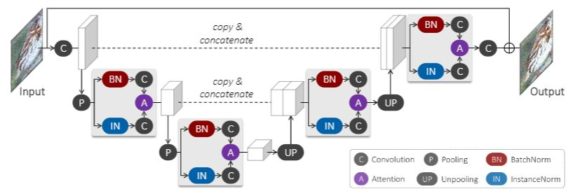

# URIE: Universal Image Enhancementfor Visual Recognition in the Wild
This is the implementation of the paper "URIE: Universal Image Enhancement for Visual Recognition in the Wild" by T. Son, J. Kang, N. Kim, S. Cho and S. Kwak. Implemented on Python 3.7 and PyTorch 1.3.1.



For more information, check our project [website](http://cvlab.postech.ac.kr/research/URIE/) and the paper on [arxiv](https://arxiv.org/abs/2007.08979).

## Requirements
You can install dependencies using
```python
pip install -r requirements.txt
```

## Datasets

You need to manually configure following environment variables to run the experiments.  
All validation csv contains fixed combination of image, corruption and severity to guarantee the same result.  
To conduct validation, you may need to change home folder path in each csv files given.  

```
# DATA PATHS
export IMAGENET_ROOT=PATH_TO_IMAGENET
export IMAGENET_C_ROOT=PATH_TO_IMAGENET_C

# URIE VALIDATION

## ILSVRC VALIDATION
export IMAGENET_CLN_TNG_CSV=PROJECT_PATH/imagenet_dataset/imagenet_cln_train.csv
export IMAGENET_CLN_VAL_CSV=PROJECT_PATH/imagenet_dataset/imagenet_cln_val.csv
export IMAGENET_TNG_VAL_CSV=PROJECT_PATH/imagenet_dataset/imagenet_tng_tsfrm_validation.csv
export IMAGENET_VAL_VAL_CSV=PROJECT_PATH/imagenet_dataset/imagenet_val_tsfrm_validation.csv

## CUB VALIDATION
export CUB_IMAGE=PATH_TO_CUB
export DISTORTED_CUB_IMAGE=PATH_TO_CUB_C
export CUB_TNG_LABEL=PATH_TO_CUB_TRAIN_LABEL
export CUB_VAL_LABEL=PATH_TO_CUB_VALIATION_LABEL
export CUB_TNG_TRAIN_VAL=PROJECT_PATH/datasets/eval_set/tng_tsfrm_validation.csv
export CUB_TNG_TEST_VAL=PROJECT_PATH/datasets/eval_set/val_tsfrm_validation.csv
```

## Training
Training URIE with the proposed method
```sh
python srcnn_main.py --batch_size 112 \
                     --cuda \
                     --test_batch_size 48 \
                     --epochs 30 \
                     --lr 0.0001 \
                     --seed 5000 \
                     --desc DESCRIPTION \
                     --save SAVE_PATH \
                     --load_classifier \set
                     --dataset ilsvrc \
                     --backbone r50
```

## Validation
You may use our pretrained model to validate or compare the results.

### Classification
```sh
python inference.py --srcnn_pretrained_path PROJECT_PATH/ECCV_MODELS/ECCV_SKUNET_OURS.ckpt.pt \
                    --dataset DATASET \
                    --test_batch_size 32 \
                    --enhancer ours \
                    --recog r50
```

### Detection
We have conducted object detection experiments using the codes from [github](https://github.com/amdegroot/ssd.pytorch).  
You may compare the performance with the same evaluation code with attaching our model (or yours) in front of the detection model.  
> For valid comparison, you need to preprocess your data with mean and standard deviation.

### Semantic Segmentation
We have conducted semantic segmentation experiments using the codes from [github](https://github.com/kazuto1011/deeplab-pytorch).  
For backbone segmentation network, please you pretrained [deeplabv3](https://pytorch.org/docs/stable/torchvision/models.html) on pytorch.
You may compare the performance with the same evaluation code with attaching our model (or yours) in front of the segmentation model.  
> For valid comparison, you need to preprocess your data with mean and standard deviation.

```

## BibTeX
If you use this code for your research, please consider citing:
```
@InProceedings{son2020urie,
  title={URIE: Universal Image Enhancement for Visual Recognition in the Wild},
  author={Son, Taeyoung and Kang, Juwon and Kim, Namyup and Cho, Sunghyun and Kwak, Suha},
  booktitle={ECCV},
  year={2020}
}
```
